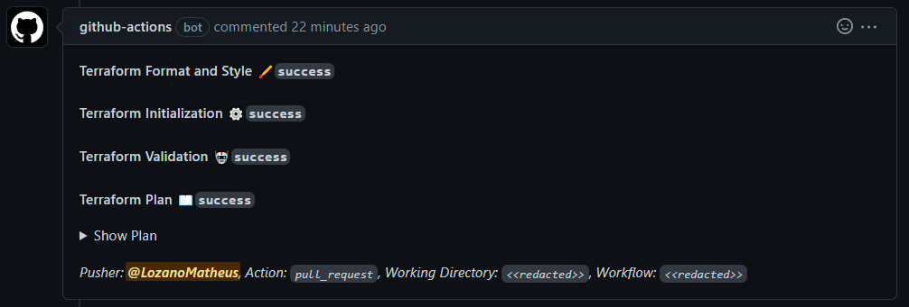

# GitHub Actions Reuse Workflows

These are workflows that you can easily re-use them.

Please, check the [Reusing workflows](https://docs.github.com/en/actions/using-workflows/reusing-workflows) official documentation.

## How to use TF checks and plan

A workflow that will run `fmt -check`, `init`, `validate`, and `plan`. In the end, it will write the output to your PR (if applicable).

```yaml
jobs:
  terraform:
    uses: LozanoMatheus/github-actions/.github/workflows/terraform-checks-and-plan.yaml@v1.0.0
    permissions:
      id-token: write ## This is because of the connection with the AWS IAM Identity Providers 
      contents: read ## This is to allow read the remote git code
      pull-requests: write ## This is to write in the PR
    with:
      workdir: codes/my_tf_code/ ## Specify the relative path to the terraform code
      aws_region: <AWS_REGION> 
      use_terragrunt: true ## This is to enable Terragrunt wrapper
      tf_modules_another_private_repo: true ## In case you're using terraform modules and those modules are hosted in a private repository, this will allow TF/TG to clone that repo
    secrets:
      aws_iam_role: <AWS_IAM_ROLE_ARN> ## This the role the GH Actions will try to communicate with your AWS OpenID connect/AWS IAM Identity Providers
      ssh_private_key: ${{ secrets.SSH_PRIVATE_KEY }} ## In case you're using terraform modules and those modules are hosted in a private repository, this will allow TF/TG to clone that repo
      aws_profile: <AWS_PROFILE> ## In case you're using a profile in your providers that's not the default, this will create a profile in the ~/.aws/credentials
```

This is an example of the comment in the PR:

