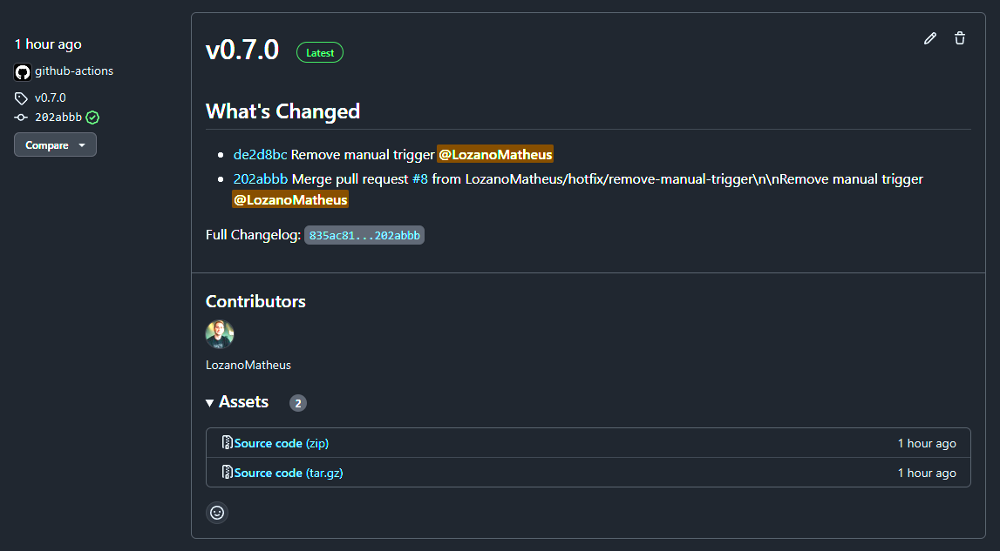

# GitHub Actions Reuse Workflows

These are workflows that you can easily re-use them.

Please, check the [Reusing workflows](https://docs.github.com/en/actions/using-workflows/reusing-workflows) official documentation.

All GitHub Actions Reuse Workflows have a specific version and the latest version will also create a latest tag/version. So, you can use `uses: ...@latest` or `uses: ...@v0.7.0`.

## GitHub Tag and Release

This workflows will create do the versioning by creating a new GitHub tag a release. It will also create a `latest` tag/release based on the latest version created.

> Note: By using the GitHub configuration `Allow merge commits` in your repository, it will allow you to use the `Create a merge commit` when merging a Pull Request. This will make a nicer `What's Changed` (e.g. [v0.7.0](https://github.com/LozanoMatheus/github-actions/releases/tag/v0.7.0)). Otherwise, it will create a bit broken (e.g. [v0.1.0](https://github.com/LozanoMatheus/github-actions/releases/tag/v0.1.0)). I'll work in a hotfix for, so any PR merge option will be nicely formatted.

```yaml
jobs:
  terraform:
    uses: LozanoMatheus/github-actions/.github/workflows/build-and-release.yaml@latest
    permissions:
      contents: write
```

This is an example of a new/latest release:


## Terraform checks and plan

This pipeline will run a few terraform (or terragrunt) commands and write the output to a PR.

* Check if it's the terragrunt wrapper is enabled
* Run `terraform/terragrunt fmt -check` command. It will fail if there is any file to be formatted
* Run `terraform/terragrunt init` command
* Run `terraform/terragrunt validate` command. This will check the code syntax
* Run `terraform/terragrunt plan -no-color -input=false` command. This will check if there is any changes to be made
* Write the output of the previous steps in the Pull Request. See the example below.

This is an example of the comment in the PR:


### How to use TF checks and plan

A workflow that will run `fmt -check`, `init`, `validate`, and `plan`. In the end, it will write the output to your PR (if applicable).

```yaml
jobs:
  terraform:
    uses: LozanoMatheus/github-actions/.github/workflows/terraform-checks-and-plan.yaml@latest
    permissions:
      id-token: write                                   ## This is because of the connection with the AWS IAM Identity Providers 
      contents: read                                    ## This is to allow read the remote git code
      pull-requests: write                              ## This is to write in the PR
    with:
      workdir: codes/my_tf_code/                        ## Specify the relative path to the terraform code
      aws_region: <AWS_REGION> 
      use_terragrunt: true                              ## This is to enable Terragrunt wrapper
      tf_modules_another_private_repo: true             ## In case you're using terraform modules and those modules are hosted in a private repository, this will allow TF/TG to clone that repo
    secrets:
      aws_iam_role: <AWS_IAM_ROLE_ARN>                  ## This the role the GH Actions will try to communicate with your AWS OpenID connect/AWS IAM Identity Providers
      ssh_private_key: ${{ secrets.SSH_PRIVATE_KEY }}   ## In case you're using terraform modules and those modules are hosted in a private repository, this will allow TF/TG to clone that repo
      aws_profile: <AWS_PROFILE>                        ## In case you're using a profile in your providers that's not the default, this will create a profile in the ~/.aws/credentials
```

## Terraform Apply

This pipeline will run only `plan` and `apply`. It's also using the [Manual Workflow Approval](https://github.com/marketplace/actions/manual-workflow-approval) before running the terraform/terragrunt apply.

* Check if it's the terragrunt wrapper is enabled
* Run `terraform/terragrunt plan -out=tf-plan.out -input=false --terragrunt-non-interactive`
* Create an GitHub Issue asking for approval
* If approved, run `terraform/terragrunt apply "tf-plan.out" --terragrunt-non-interactive`

This is an example of the issue create for the approval:


```yaml
jobs:
  terraform:
    uses: LozanoMatheus/github-actions/.github/workflows/terraform-apply.yaml@latest
    permissions:
      id-token: write                                   ## This is because of the connection with the AWS IAM Identity Providers 
      contents: read                                    ## This is to allow read the remote git code
      issues: write                                     ## This is to create an GitHub issue
    with:
      workdir: codes/my_tf_code/                        ## Specify the relative path to the terraform code
      aws_region: <AWS_REGION> 
      use_terragrunt: true                              ## This is to enable Terragrunt wrapper
      tf_modules_another_private_repo: true             ## In case you're using terraform modules and those modules are hosted in a private repository, this will allow TF/TG to clone that repo
      require_approval: true                            ## You can use this to enable the manual approve before running the terraform/terragrunt apply
    secrets:
      aws_iam_role: <AWS_IAM_ROLE_ARN>                  ## This the role the GH Actions will try to communicate with your AWS OpenID connect/AWS IAM Identity Providers
      ssh_private_key: ${{ secrets.SSH_PRIVATE_KEY }}   ## In case you're using terraform modules and those modules are hosted in a private repository, this will allow TF/TG to clone that repo
      aws_profile: <AWS_PROFILE>                        ## In case you're using a profile in your providers that's not the default, this will create a profile in the ~/.aws/credentials
```
